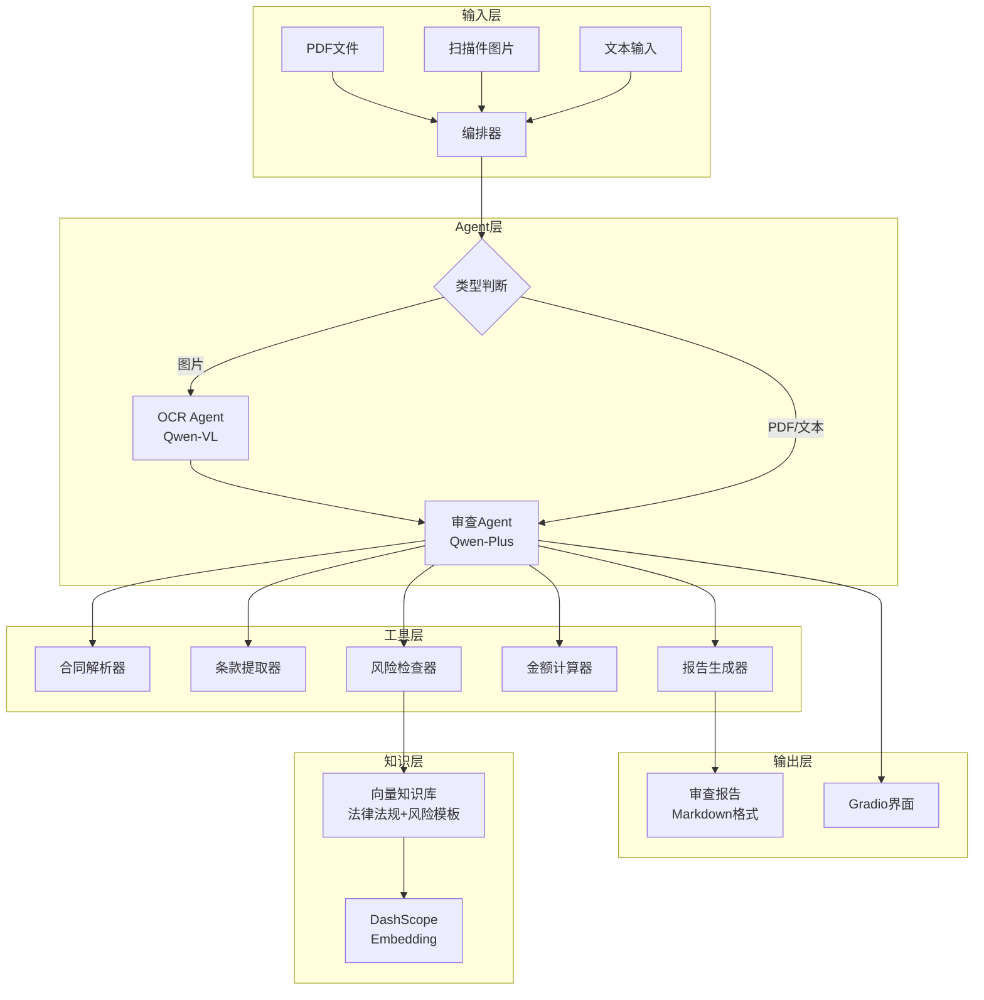

# 智能合同审查Agent

[English](./README_EN.md) | **中文**

基于阿里千问（Qwen）生态构建的智能合同审查系统，整合 **Agent编排**、**RAG检索增强**、**多模态OCR**、**端侧部署** 四个方向。

## 系统架构



## 核心特性

- **多格式支持** — PDF文本、扫描件图片、纯文本输入
- **ReAct多步推理** — Agent自主规划并链式调用工具，完成完整审查流程
- **RAG知识库** — 内置法律法规和风险条款模板，检索增强审查准确性
- **多模态OCR** — 使用Qwen-VL识别合同扫描件
- **灵活部署** — 支持云端API（DashScope）和本地Ollama / vLLM两种模式

## 快速开始

### 1. 安装依赖

```bash
pip install -r requirements.txt
```

### 2. 配置环境变量

```bash
cp .env.example .env
# 编辑 .env，填入你的 DASHSCOPE_API_KEY
```

### 3. 构建知识库

```bash
python knowledge/build_kb.py
```

### 4. 验证API连通性

```bash
python quick_test.py
```

### 5. 启动前端

```bash
python app/gradio_app.py
# 访问 http://localhost:7860
```

## 项目结构

```
├── config/                  # 配置模块
│   ├── model_config.py      # 模型配置（云端/本地切换）
│   └── prompts.py           # 系统提示词模板
├── tools/                   # 自定义工具（5个BaseTool）
│   ├── contract_parser.py   # 合同解析（PDF提取 + OCR）
│   ├── clause_extractor.py  # LLM驱动的条款提取
│   ├── risk_checker.py      # RAG增强的风险检查
│   ├── amount_calculator.py # 确定性金额与日期计算
│   └── report_generator.py  # Markdown报告生成
├── knowledge/               # RAG知识库
│   ├── build_kb.py          # 构建流程（分块 → 向量化 → 存储）
│   ├── legal_docs/          # 8篇法律法规文档
│   └── risk_templates/      # 常见风险条款模板
├── agents/                  # Agent编排
│   ├── review_agent.py      # 主审查Agent（ReAct循环）
│   ├── ocr_agent.py         # 多模态OCR Agent
│   └── orchestrator.py      # 输入路由（代码判断，非LLM）
├── app/                     # 前端应用
│   └── gradio_app.py        # Gradio交互式Demo
├── deploy/                  # 部署方案
│   ├── cloud_deploy.md      # DashScope云端部署指南
│   ├── edge_deploy.md       # Ollama / vLLM本地部署指南
│   └── benchmark.py         # 性能评测脚本
├── tests/                   # 测试（共21个）
│   ├── test_tools.py        # 14个工具单元测试（9离线+5在线）
│   └── test_agent.py        # 7个Agent端到端测试（4离线+3在线）
└── docs/
    ├── architecture.md
    ├── tam_solution.md
    └── performance_report.md
```

## 技术栈

| 组件 | 技术 | 说明 |
|------|------|------|
| 框架 | [Qwen-Agent](https://github.com/QwenLM/Qwen-Agent) | 阿里官方Agent框架，ReAct + 工具注册 |
| 模型 | qwen-plus / qwen-vl-plus | DashScope API 文本生成与视觉理解 |
| 向量化 | text-embedding-v3 | 1024维向量，用于RAG检索 |
| 前端 | Gradio | 交互式Demo界面 |
| 本地部署 | Ollama / vLLM | 端侧模型推理服务 |

## 设计原则

1. **确定性逻辑用代码，语义理解用模型** — 路由和计算在Python中实现（`if-else`、纯数学），只有需要语言理解的任务交给模型。
2. **全链路OpenAI兼容接口** — 云端DashScope和本地Ollama切换只需改`base_url`和`model`，业务代码零改动。
3. **工具即边界** — 每个`BaseTool`有清晰的输入输出契约。Agent决定"何时"调用工具，工具决定"如何"执行。

## 性能对比

| 模型 | TTFT | 生成速度 | 提取质量 | 推荐场景 |
|------|------|---------|---------|---------|
| qwen-turbo | ~1.2秒 | 33.5 tok/s | 83% | 开发调试 |
| qwen-plus | ~1.1秒 | 10.8 tok/s | 83% | 生产推荐 |

运行评测：

```bash
python deploy/benchmark.py
```

## 测试

```bash
# 仅离线测试（无需API Key）
pytest tests/ -v -k "offline"

# 全部测试（需要 DASHSCOPE_API_KEY）
DASHSCOPE_API_KEY=sk-xxx pytest tests/ -v
```

## 许可证

MIT
