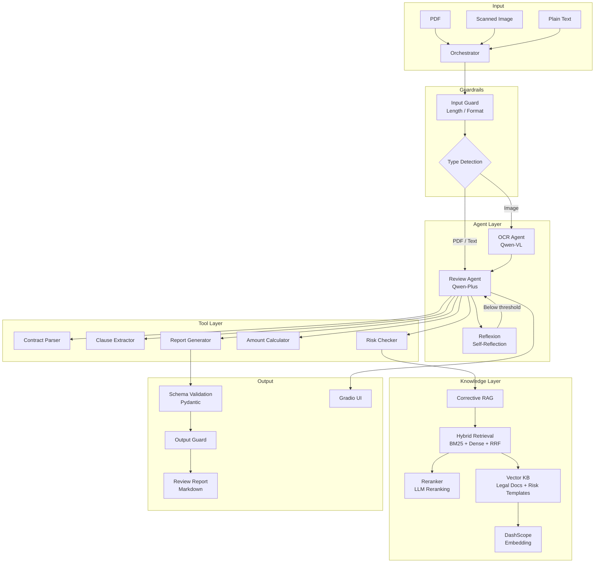

# Qwen Contract Agent

**English** | [中文](./README.md)

An intelligent contract review system built on the Alibaba Qwen ecosystem, integrating **Agent orchestration**, **RAG**, **multimodal OCR**, and **edge deployment**.

## Architecture



## Key Features

- **Multi-format input** — PDF, scanned images, plain text
- **ReAct reasoning** — Agent autonomously plans and chains tool calls to complete a full review
- **Hybrid RAG** — BM25 sparse + Dense retrieval + RRF fusion + LLM Reranker
- **Corrective RAG** — Retrieval quality self-check with automatic query rewriting (Multi-Query)
- **Reflexion** — 5-dimension quality evaluation with self-reflection and experience accumulation
- **Guardrails** — Input validation + cost control + output structure verification (3-layer defense)
- **Structured Output** — Pydantic schemas for review reports, risk assessments, and evaluations
- **Multimodal OCR** — Uses Qwen-VL to recognize scanned contract documents
- **Flexible deployment** — Cloud API (DashScope) or local Ollama / vLLM

## Quick Start

### 1. Install dependencies

```bash
pip install -r requirements.txt
```

### 2. Configure environment

```bash
cp .env.example .env
# Fill in your DASHSCOPE_API_KEY
```

### 3. Build the knowledge base

```bash
python knowledge/build_kb.py
```

### 4. Verify API connectivity

```bash
python quick_test.py
```

### 5. Launch the UI

```bash
python app/gradio_app.py
# Open http://localhost:7860
```

## Project Structure

```
├── config/                  # Configuration
│   ├── model_config.py      # Model config (cloud / local switch)
│   ├── prompts.py           # System prompt templates
│   └── schemas.py           # Pydantic structured output schemas
├── tools/                   # Custom tools (5 × BaseTool)
│   ├── contract_parser.py   # PDF extraction + OCR
│   ├── clause_extractor.py  # LLM-driven clause extraction
│   ├── risk_checker.py      # Corrective RAG risk analysis
│   ├── amount_calculator.py # Deterministic amount & date math
│   └── report_generator.py  # Markdown report assembly
├── knowledge/               # RAG knowledge base
│   ├── build_kb.py          # Build pipeline (chunk → embed → BM25 → store)
│   ├── reranker.py          # Reranker module (LLM / CrossEncoder)
│   ├── legal_docs/          # 8 legal reference documents
│   └── risk_templates/      # Common risk clause templates
├── agents/                  # Agent orchestration
│   ├── review_agent.py      # Main review agent (ReAct loop)
│   ├── ocr_agent.py         # Multimodal OCR agent
│   ├── orchestrator.py      # Input routing + Reflexion orchestration
│   ├── reflexion.py         # Self-reflection & experience accumulation
│   └── guardrails.py        # Guardrails (input / cost / output)
├── app/                     # Frontend
│   └── gradio_app.py        # Gradio interactive demo
├── deploy/                  # Deployment & Evaluation
│   ├── cloud_deploy.md      # DashScope cloud deployment guide
│   ├── edge_deploy.md       # Ollama / vLLM local deployment guide
│   ├── benchmark.py         # Performance benchmark script
│   └── rag_eval.py          # RAGAS-style RAG evaluation framework
├── tests/                   # Tests (68+ total)
│   ├── test_tools.py        # 14 tool unit tests
│   ├── test_agent.py        # 7 agent E2E tests
│   ├── test_rag_advanced.py # 47 advanced feature tests
│   └── rag_golden_dataset.json  # 18-question RAG golden dataset
└── docs/
    ├── architecture.md
    ├── tam_solution.md
    └── performance_report.md
```

## Tech Stack

| Component | Technology | Purpose |
|-----------|-----------|---------|
| Framework | [Qwen-Agent](https://github.com/QwenLM/Qwen-Agent) | Agent framework with ReAct, tool registration |
| LLM | qwen-plus / qwen-vl-plus | Text generation & vision via DashScope API |
| Embedding | text-embedding-v3 | 1024-dim vectors for RAG retrieval |
| Sparse Retrieval | BM25 (Okapi) | Keyword matching, complementary to dense |
| Structured Output | Pydantic v2 | Schema-constrained LLM output |
| Frontend | Gradio | Interactive demo UI |
| Local deploy | Ollama / vLLM | On-premise model serving |

## Design Principles

1. **Deterministic logic in code, semantic understanding in LLM** — Routing and calculations are done in Python (`if-else`, pure math); only tasks requiring language understanding go to the model.
2. **OpenAI-compatible interface everywhere** — Switching between DashScope cloud and local Ollama only requires changing `base_url` and `model`; zero business code changes.
3. **Tools are the boundary** — Each `BaseTool` has a clear input/output contract. The agent decides *when* to call tools; the tools decide *how* to execute.
4. **Defense in depth** — Input guard → cost control → output validation, three-layer guardrails for safe and controllable Agent behavior.
5. **Don't blindly trust retrieval** — Corrective RAG evaluates retrieval quality before use; rewrites queries when results are insufficient.

## Benchmark

| Model | TTFT | Generation Speed | Extraction Quality | Recommended For |
|-------|------|-----------------|-------------------|----------------|
| qwen-turbo | ~1.2 s | 33.5 tok/s | 83% | Development & debugging |
| qwen-plus | ~1.1 s | 10.8 tok/s | 83% | Production (best cost/quality) |

Run your own benchmark:

```bash
python deploy/benchmark.py
```

## Testing

```bash
# Offline tests only (no API key needed)
pytest tests/ -v -k "offline"

# Advanced feature offline tests (47 tests)
pytest tests/test_rag_advanced.py -v -k "offline"

# All tests (requires DASHSCOPE_API_KEY)
DASHSCOPE_API_KEY=sk-xxx pytest tests/ -v
```

## RAG Evaluation

Built-in RAGAS-style evaluation framework with Context Precision, Recall, MRR, and more:

```bash
# Retrieval metrics only (no LLM calls)
python deploy/rag_eval.py

# Full evaluation (with LLM-as-Judge)
python deploy/rag_eval.py --full
```

## License

MIT
