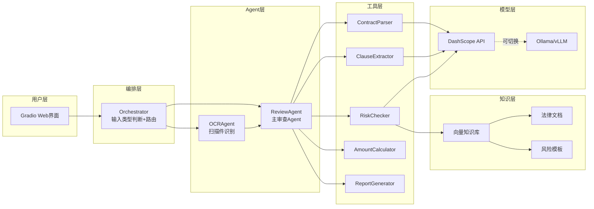

# 技术架构详解

## 整体架构

系统采用分层架构设计，从上到下分为：输入层、编排层、Agent层、工具层、知识层、模型层。



## 数据流

### 完整审查流程

```
用户上传PDF
  -> Orchestrator判断为PDF类型
  -> ReviewAgent启动ReAct循环
    -> Thought: "需要先解析PDF"
    -> Action: contract_parser(file_path)
    -> Observation: 合同全文文本
    -> Thought: "接下来提取关键条款"
    -> Action: clause_extractor(contract_text)
    -> Observation: JSON格式条款
    -> Thought: "检查风险"
    -> Action: risk_checker(clauses)
      -> 内部: RAG检索相关法条
      -> 内部: LLM基于法条分析风险
    -> Observation: 风险评估结果
    -> Thought: "验证金额"
    -> Action: amount_calculator(params)
    -> Observation: 计算结果
    -> Thought: "生成报告"
    -> Action: report_generator(all_results)
    -> Observation: Markdown报告
    -> Final Answer: 审查报告
```

## 关键设计决策

### 1. 工具和LLM的分工

确定性逻辑用代码，语义理解用LLM：

| 任务 | 实现方式 | 原因 |
|------|---------|------|
| PDF文本提取 | PyPDF2（代码） | 确定性操作 |
| 扫描件OCR | Qwen-VL（LLM） | 需要视觉理解 |
| 条款提取 | qwen-plus（LLM） | 需要语义理解 |
| 风险分析 | RAG+LLM | 需要知识检索+推理 |
| 金额计算 | Python（代码） | 数值计算LLM不可靠 |
| 报告生成 | Python模板（代码） | 格式固定，用模板更可控 |

### 2. RAG架构选择

选择自建轻量RAG而非LangChain：
- 依赖更少，部署更简单
- 代码透明，方便学习理解
- 对于法律文档场景足够使用
- 后续可平滑迁移到更复杂的方案

### 3. Agent编排策略

选择代码路由而非Agent路由：
- 文件类型判断是确定性逻辑，代码更可靠
- 减少一次LLM调用，降低延迟和成本
- 路由逻辑简单，不需要LLM的推理能力
